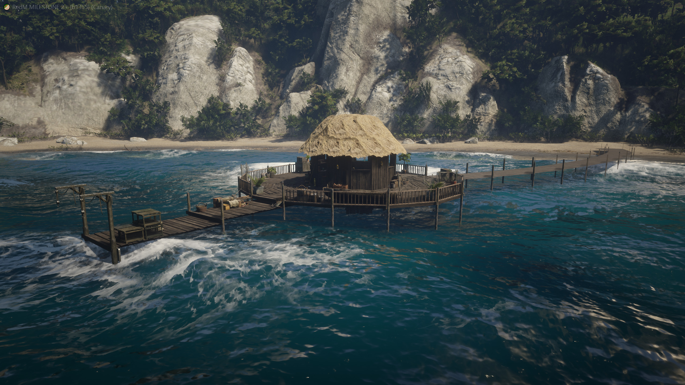
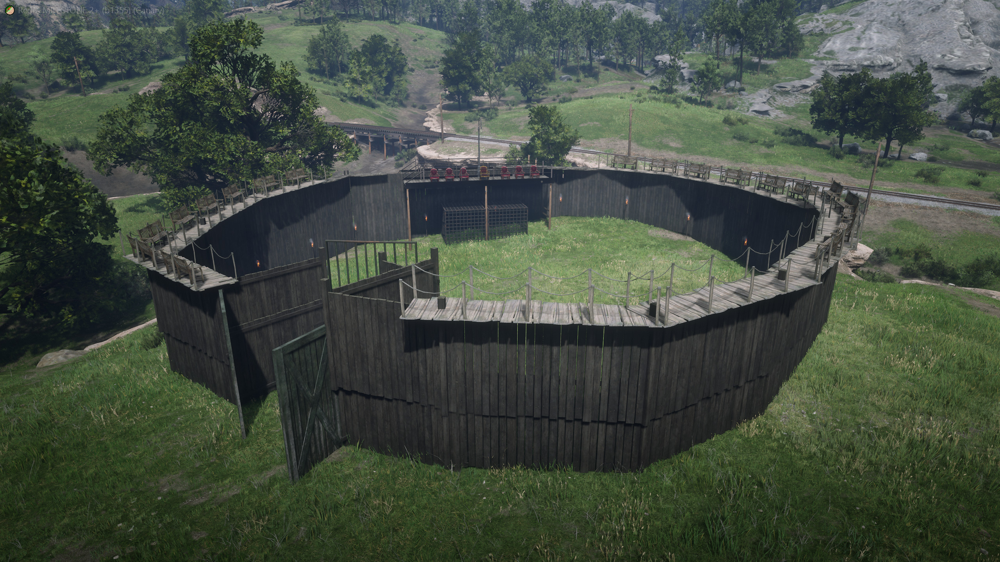

# lambda2ymap

Convert [Lambdarevolution map editor](https://allmods.net/red-dead-redemption-2/tools-red-dead-redemption-2/rdr2-map-editor-v0-10/) maps to ymap.

## Requirements

- An XSLT processor with EXSLT support, such as [libxslt's xsltproc](http://www.xmlsoft.org/)

## Usage

1. Obtain a Lambdarevolution map editor map.
   
   Example: https://www.nexusmods.com/reddeadredemption2/mods/253.

2. Convert the map to a ymap with the [lambda2ymap.xsl](lambda2ymap.xsl) XSLT script:
   ```
   $ xsltproc lambda2ymap.xsl Guarma_Stilt_House_Complete.xml > guarma_stilt_house.ymap
   ```

3. Create a new resource folder.
   
   Example: `guarma_stilt_house`.

4. Create a `stream` folder inside of the resource and place the ymap inside of it.

5. Create the `fxmanifest.lua`:
   ```lua
   fx_version "adamant"
   game "rdr3"
   rdr3_warning "I acknowledge that this is a prerelease build of RedM, and I am aware my resources *will* become incompatible once RedM ships."
   
   this_is_a_map "yes"
   ```

6. Add `start guarma_stilt_house` to `server.cfg`.

## Examples

| | | |
|-|-|-|
| [](examples/fishermans_bay) | [](examples/gladiator) | [](examples/guarma_stilt_house) |
